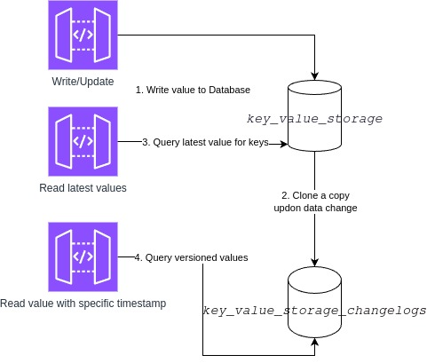

# Key-Value-Data-Storage


 [Coverage Report](https://code-coverage.duckonemorec.me/)

## Introduce

> This is a laravel package which allows application to establish the ability to store and retrieve key-value objects.
>
> The storage engine supports primary data type such as `string`, `null`, `json`, `array` and `bool`.

## How the storage value works

> The key-value pair object will be stored into database within `key_value_storage` table.
>
> For the performance purpose, Only latest version of existing keys will be stored inside `key_value_storage`.

> For every data changes from `key_value_storage` table, there will be 1 snapshot created
> in `key_value_storage_changelogs` table via database trigger.

<figure>
    
    <figcaption>key-value object dataflow</figcaption>
</figure>

## Installation

```shell
composer composer config repositories.key-value-data-storage git git@github.com:minhducck/key-value-data-storage.git
composer require minhducck/key-value-data-storage;
```

## Configuration

| ENV Var                                     | Available Value | Default | Description                                  |
|---------------------------------------------|-----------------|---------|----------------------------------------------|
| KEY_VALUE_STORAGE.ENABLE                    | `1` \| `0`      | `0`     | To enable the Module                         |
| KEY_VALUE_STORAGE.RESTRICT_READ_PERMISSION  | `1` \| `0`      | `0`     | To enable authentication for READ resources  |
| KEY_VALUE_STORAGE.RESTRICT_WRITE_PERMISSION | `1` \| `0`      | `0`     | To enable authentication for WRITE resources |

## Table declaration

### `key_value_storage`

_Storing the latest version for all keys_

| Field     | Datatype     | Comment                             | Index |
|-----------|--------------|-------------------------------------|-------|
| key       | varchar(250) | Primary Key / Key of the object     | PK    |
| value     | longtext     | Value of the object                 | \-    |
| metadata  | json         | Storing value metadata ( datatype ) | \-    |
| timestamp | timestamp    | Created timestamp                   | \-    |

### `key_value_storage_changelogs`

_Storing the versioned for keys with timestamp_

| Field     | Datatype     | Comment                             | Index |
|-----------|--------------|-------------------------------------|-------|
| id        | int          | Primary Key                         | PK    |
| key       | varchar(250) | Primary Key / Key of the object     | Btree |
| value     | longtext     | Value of the object                 | \-    |
| metadata  | json         | Storing value metadata ( datatype ) | \-    |
| timestamp | timestamp    | Created timestamp                   | Btree |

## APIs

### Insert/Update key-value objects

#### `[POST]` {base_url}/object

```http request
POST /object HTTP/1.1
Host: {baseUrl}
Content-Type: application/json
Accept: application/json
```

#### Payload

_Using the key-value pairs. Value can be `number` `string` `bool` `array` `object`_

```JSON
{
  "boolValue": true,
  "arrVal": [
    "sample",
    0,
    1
  ],
  "nestedObj": {
    "hello": "world"
  },
  "floatVar": 303.202,
  "nullish": null
}
```

#### Response:

_Return the time of write event following Iso8601 format_

```JSON
{
  "time": "1990-11-23T18:56:16+00:00"
}
```

### Retrieve latest version for all key-value objects

#### `[GET]` {base_url}/get_all_records

```http request
GET /object/get_all_records HTTP/1.1
Host: {baseUrl}
Content-Type: application/json
Accept: application/json
```

#### Response:

_Return the list of available keys and theirs latest values_

```JSON
{
  "arrayList": [
    1,
    2,
    3
  ],
  "arrVal": [
    "sample",
    0,
    1
  ],
  "boolFalse": false,
  "boolTrue": true,
  "boolValue": true,
  "floatVar": 303.202,
  "name": "Add your name in the body",
  "nestedObj": {
    "hello": "world",
    "goTo": {
      "city": "deepnest"
    }
  },
  "nullish": null,
  "nullValue": null,
  "num": 10,
  "numFloat": 10.1239,
  "objectValue": {
    "hello": "world"
  }
}
```

### Retrieve versioned value by key

#### `[GET]` {base_url}/object/{key}?timestamp={timestamp}

_If the query `timestamp` is not present or setting as nullish value the current timestamp will be replaced ( make sure
the latest version is fetched )_

```http request
GET /object/numFloat?timestamp=1715536019 HTTP/1.1
Host: {baseUrl}
Content-Type: application/json
Accept: application/json
```

#### Response:

_Return the object with versioned value for specific key_

```JSON
{
  "numFloat": 10.1239
}
```


